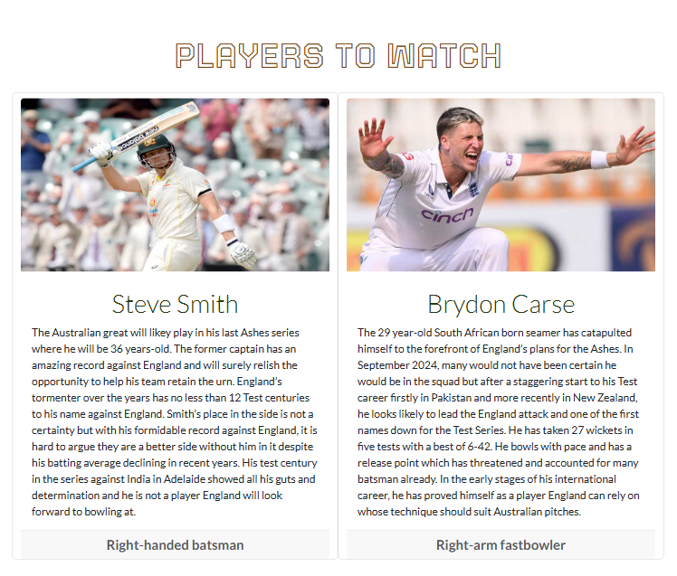

  

  

## Table of Contents

    
<a href="#about">1. About</a>

<a href="https://david5p.github.io/The-Ashes-2025-2026/">The Ashes 2025/2026 </a> project is a website for Cricket fans particularly those with an interest in England and Australia. The website is targeted towards adults with the language used and volume of information included. 

Users of the website will be able to find information about the upcoming Ashes including the schedule of the Test Series and the Players to Watch. There is also a sign up to the newsletter form so users can get all the latest stories ahead of The Ashes 2025/2026.

2. 

    
<a href="#ux">User Experience</a>

    <ul>
    <li>

    
<a href="#goals">Goals</a>

    - [Visitor Goals](#visitor-goals)
    - [Business Goals](#business-goals)
    - [User Stories](#user-stories)
    
</li>

    <li>

    
<a href="#visual-design">Visual Design</a>

    - [Wireframes](#wireframes)
    - [Fonts](#fonts)
    - [Icon](#icon)
    - [Colors](#colors)
    - [Images](#images)
    - [Styling](#styling)
    
</li>
    </ul>

3. 

    
<a href="#features">Features</a>

    <ul>
    <li>

    
<a href="#page-elements">Page Elements</a>

    - [All Pages](#all-pages)
    - [Index Page](#index-page)
    - [Gallery Page](#gallery-page)
    - [Schedule Page](#schedule-page)
    
</li>

    <li>

    
<a href="#additional-features">Additional Features</a>

    - [Success Page](#success-page)
    - [Error Page](#error-page)
    
</li>

    <li>

    
<a href="#technologies-used">Technologies Used</a>

    - [Languages](#languages)
    - [Frameworks](#frameworks)
    - [Libraries](#libraries)
    - [Platforms](#platforms)
    - [Other Tools](#other-tools)

4. 

    
<a href="#testing">Testing</a>

    <ul>
    <li>

    
<a href="#methods">Methods</a>

    - [Validation](#validation)
    - [General Testing](#general-testing)
    - [Lighthouse and Pagespeed Insights](#lighthouse-and-pagespeed-insights)
    
</li>

    <li>

    
<a href="#bugs">Bugs</a>

    - [Known Bugs](#known-bugs)
    - [Fixed Bugs](#fixed-bugs)
    
</li>
    </ul>

5. 

    
<a href="#deployment">Deployment</a>

    <ul>
    <li>

    
<a href="#local-deployment">Local Deployment</a>

    - [Local Preparation](#local-preparation)
    - [Local Instructions](#local-instructions)
    
</li>

    <li>

    
<a href="#github-deployment">Github Deployment</a>

    - [Github Preparation](#github-preparation)
    - [Github Instructions](#github-instructions)
    
</li>
    </ul>

6. 

    
<a href="#credit-and-contact">Credit and Contact</a>

    - [Content](#content)
    - [Contact](#contact)

----

# User Experience (UX)
## Goals
### Visitor Goals
The target audience for The Ashes 2025/2026 are:
- People who are interested in Cricket.
- People from England and Australia.
- People who may want to find out about a particular player.
- People who may wan to find out when The Ashes are taking place.
- People interested in finding a source for all of their Ashes news.

User goals are:
- View a gallery of photos of potential players.
- View a schedule of when The Ashes are taking place.
- Sign up to the Newsletter for all your Ashes news.
- Summary of some key players provided.

The Ashes 2025/2025 fulfills these needs by:
- Providing a Players to Watch section on the homepage.
- Sign up to the Newsletter button is present on the header and footer of all pages.
- Social media links to keep up to date with all The Ashes news are provided in the footer.
- Gallery section features lots of potential players expected to feature in The Ashes.
- Schedule page including all the information on each test match.
- Appropriate home page image drawing users attention to the trophy the two teams will be battling for.

### Business Goals
The Business Goals of The Ashes 2025/2026:
- Provoke cricket fans interest ahead of The Ashes.
- Prominently display Newsletter button so users sign up to keep up to date with all the latest news.
- Users can gain an interest and follow The Ashes 2025/2026 on social media platforms.
- Provide a point of contact for all things Ashes related through the social media channels, email and the Newsletter.

### User Stories

1. When using the website for the first time, I need a simple navigation system with user friendly design. It needs to work well on mobile, tablet and desktop without issues.

0. As a cricket fan, I want to come to the site and have access to the latest information and discussion points ahead of the Ashes so I can trust the website is the place to go to for my Ashes news.

0. As a visitor, I want to see enticing and exciting images of the players expected to feature in The Ashes.

0. As a cricket fan,  I need to be able to engage with the latest news so I can talk to others about it.

0. As a cricket fan,  I need to know when the Ashes are taking place including the dates of each Test and the location so I can follow the event.

0. As a user,  I want to know which players I should look out for ahead of The Ashes and may make a late surge to be in the team. 

0. As a follower of The Ashes,  I want to be able to engage in the news I am receiving and ask and receive answers to questions in a podcast.

0.  As a cricket fan,  I want to be able to engage in the news I am receiving and pick my team so I can se how the teams will line up against one another.

## Visual Design

### Wireframes 
Wireframes: https://drive.google.com/file/d/1a32cbliw3gqd6RI-CHryG4O8BNo6Vx8r/view?usp=sharing

### Fonts

  

- The primary font, <a href="https://fonts.google.com/specimen/Lato">Lato</a> was chosen because it provides both readability and style. It is a font that is user friendly providing warmth and also a gives the website a professional feel. This sans-serif font combines well with the color schemes chosen in the website ensuring readability on each section of the website and provides a good contrast from the headings font.

- The secondary font, <a href="https://fonts.google.com/specimen/Tourney">Tourney</a> was chosen to make the headings stand out and provide a font style which transforms the headings in headlines. It is also a font which is seen in sports stadiums so I felt it complimented The Ashes theme. The font works well with large text and combines well with the style and professional feel of the primary font choice. 

### Icons

  

-Icons are linked from the <a href="https://fontawesome.com/">Fontawesome</a> Icon library and are applied as classes using the '<i>' tag
- By applying them through classes, they are suited to having styles applied to them. I was able to target them in my footer using custom css.
- Through targeting the icons using custom css, I was able to ensure sufficient contrast with my background as well as permitting sufficient padding between the icons.

###Colors
- I picked the colors of the website from the hero image using an <a href="https://imagecolorpicker.com/">image color picker</a> tool to help me with my choices.
- The green and brown colors combine well and are colors which are synonymous with the cricket and The Ashes. 
. I initially picked a light green for the navbar, icons and for styling the buttons but this presented some contrast issues with the dark green and brown so I changed to a light blue which compliments my other color choices well. 
- Text for paragraphs or sub-headings is written in either black or a dark green where there is a white background and this ensure clear legibility of the writing.
- The dark brown font for the main-headings displays a good contrast on white backgrounds whilst also suiting the theme of The Ashes.
- The white and light blue used predominantly in the navbar and footer stand out against the two backgrounds.  

### Images
- The main image on the homepage was chosen as it defines what the trophy and history the players will be playing for.
. The gallery page is displayed in a responsive way thanks to the Bootstrap grid system seeing the layout change for the various devices.

### Styling

- I used Bootstrap 5.3 classes where possible to support with positioning and text style and size.
- I have applied my preferred colors and fonts using custom css.

# Features
## Page Elements
### All Pages
#### Navbar

  
  

- The Navbar used from Bootstrap is fully responsive working on all devices.
- On Desktop screens the full menu is displayed with Home, Gallery, Schedule, Contact Us and Sign up to the Newsletter button shown.
- The Sign up to the Newletter button is prominently displayed in the navbar so the user can clearly see and respond to the call to action.
On Tablets and mobile screens the navbar becomes collapsible 
- The logo aligns to the left of the screen and is visible on all devices
- On smaller devices, the menu becomes collapsible with the Sign up to the Newsletter button featuring in thetablet and mobile menu.
- The mobile nav button has been placed to the right for ease of use with one hand.
- The navbar is fixed so it is visible at all times on the screen.
- When the menu is collapsible and a user selects an option the menu collapses again so the content can be seen.

#### Footer

  
  

- Positioned at the bottom of each page and consists of the Contact Us and Sign up to the Newsletter sections.
- The Bootstrap class of Justify Content Around allows the footer to spaced appropriately on desktop screens.
- On tablet and mobile devices the footer is responsive and the Contact Us section stacks on top of the  Sign up to the Newsletter section.
- The Social media icons are styled and posititioned well on all devices.
-Sign up to the Newsletter section contains a form which is fully responsive and validated.
- The form will only send if it is completed with an appropriate email address and a name.
-Upon completion of the form, users will be taken to a success page letting the user know that their contribution has been received.

### Index Page

  
  

- I chose an appropriate hero image to display alongside an introduction about the website's focus on desktop devices (see image above).
- On tablets and smaller devices the hero image and paragraph take up the whole window so that the image of The Ashes is at the forefront of the website
- After setting the scene with the hero imagee, I wanted to provide the user with concrete information to build up as sense of excitemnt about The Ashes so I  selected some of the main expected protagonists of The Ashes as a method to preview and entice the user to read more on the website. 
-This Players to Watch section see above image was displayed using card templates from Bootstrap which helped to create consistency and responsiveness.

### Gallery Page

  

- Uses the Bootstrap grid system for responsiveness functioning well on all devices.
- Displays three columns on large screens, two on medium screens and one on mobile screens.
- All images have alt tags to ensure website's accessibility.
- Custom CSS applied to ensure emails have appropriate padding and are full width and height.

### Schedule Page

  

- Schedule page performs a simple but effective purpose letting the user know the when and where of every test match.
- Page displayed using cards for each of the five test venues ensuring information is presented in a clear and concise manner.
- With the assistance of Bootstrap cards and the Bootstrap grid system the schedule lay out works well on all devices. 

## Additional Features 

### Success Page
- This page was designed to let the user know their form has successively been submitted and provide the opportunity for them to click back to return browsing the website.
- The styling of the page is inline with the rest of the website.

### Error 404
- This page lets the user know an error has occurred and the custom nature of the page allows the user to click back on a link which returns them to the website rather that the user potentially leaving for another website.

# Technologies Used
## Languages
- HTML
    * Page markup.
- CSS
    * Styling.

## Frameworks
- [Bootstrap5](https://getbootstrap.com/)
    * Used for basic styles and layout templates.

## Libraries
- [Google Fonts](https://fonts.google.com)
    * Font Styles.
- [Fontawesome](https://fontawesome.com/)
    * Used for icons

## Platforms
- [Github](https://github.com/)
    * Storing code remotely and deployment.
- [Gitpod](https://gitpod.io/)
    * IDE for project development.

## Other Tools
- [Balsamiq](https://balsamiq.com/)
    * To create wireframes.
- [Image Color Picker](https://imagecolorpicker.com/)
    * Choosing color pallette.
- [WebAIM](https://webaim.org/resources/contrastchecker/)
    * Affirming color choices.

# Testing
## Methods
### Validation
| App           | Screenshot                                                                 |
|-----------    |----------------------------------------------------------------------------|
| index.html    | 

No errors report

 |
| gallery.html  | 

No errors report

 |
| schedule.html | 

No errors report

 |
| success.html  | 

No errors report

 |
| style.css     | 

No errors report

 |

- As the table above shows the HTML has been validated with [W3C HTML5 Validator](https://validator.w3.org/) and the CSS has been validated with [W3C CSS Validator](https://jigsaw.w3.org/css-validator/).
- The CSS valididator did flag six warnings with one making reference to the imported Google Fonts and the other five accounted for by each of the CSS variables.
-With regards to my HTML code I had some errors to fix before zero were shown. I had a surplus of closing div elements. I also had accidentally repeated a class on the anchor element.  Furthermore, I had an error with my form validity where I made error with labelling the <a href="assets/images/read_me/test/form_error.png">type attribute</a>.

### General Testing

- The website was tested across Google Chrome, Safari, Mozilla Firefox and the mobile test was done using Google Dev tools and an Asus Zenfone 9 and no issues were found.

- Each time new features were added the preview and the deployed site were checked for functionality.

- The website was tested by friends on both mobile and desktop devices.

- Form validity was checked as well as the navbar and buttons remaining functional as the website was developed.

- External social media links open in a new tab.

- The user strories provided a noteworthy reference point and I was allowed to ensure and test that all of the must haves were achieved for the website.

- The website's functionality was primarily checked and assessed on Google chrome and using inspect to check fuctionality on different screen sizes. 

### Lighthouse and PageSpeed Insights
- I tested the website on PageSpeed Insights which allowed me to find out that my form was not labelled correctly and not all my images had alt tags which explained why the accessibility rating was not 100%. As you can see <a href="assets/images/read_me/test/pagespeed_desktop.png">PageSpeed Insights desktop</a>, <a href="assets/images/read_me/test/pagespeed_mobile.png">PageSpeed Insights mobile</a> and<a href="assets/images/read_me/test/lighthouse.png">Lighthous</a> have given the website 100% for accessibility.
 